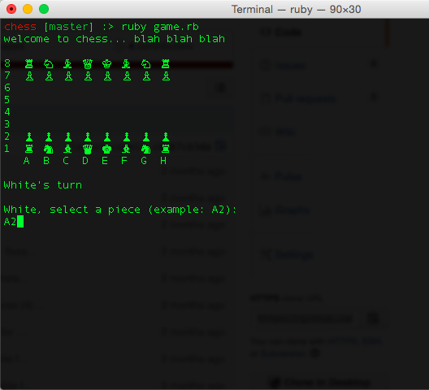
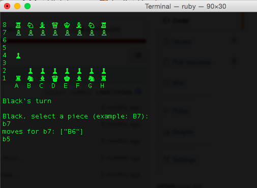
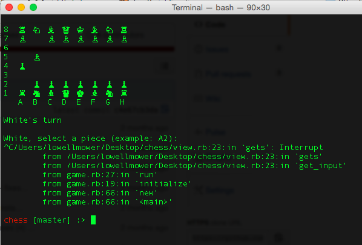

# Command Line Chess
### A simple chess game for the command line. Please feel free to clone, fork, play, enjoy!
# Installation:
```sh
$ git clone [git-repo-url]
$ cd /chess
$ ruby game.rb
```
# Game Play:


#### type in moves:


#### to quit, hit control + C

